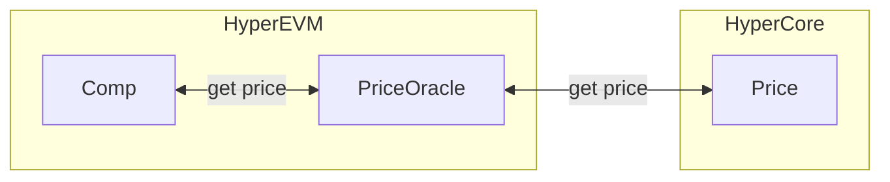

# Lending

Compound-based lending markets, powered by an upgradeable `Comptroller` and a `PriceOracle` that talks to the HyperCore precompile.

`SpotPriceOracle.sol`
- Wraps a single staticcall to the HyperCore mark-price precompile so on-chain prices stay in sync with the L1 engine

---

# Script

Deploy everything with `deploy.js`.
